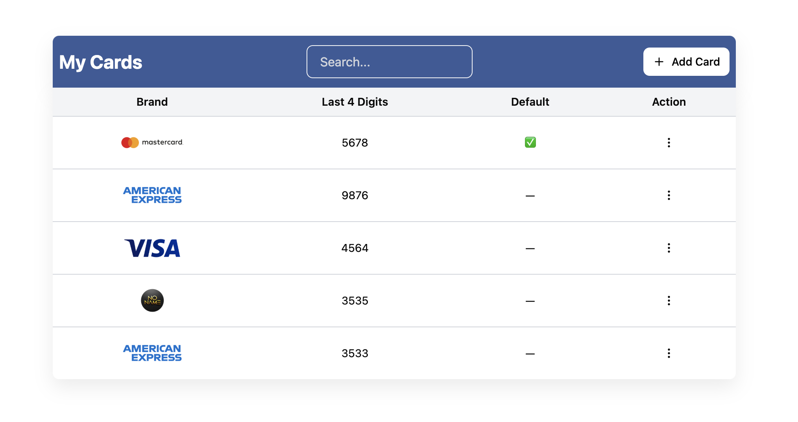
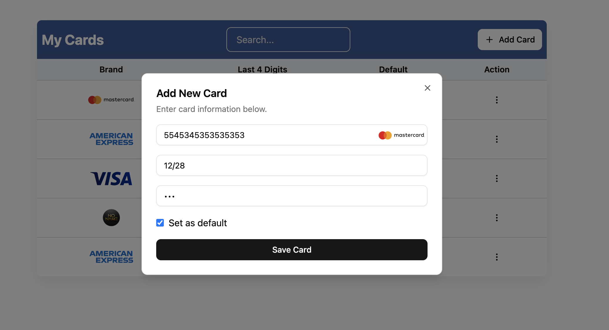

## Getting Started

Getting started is a simple as cloning the repository

```
git clone git@github.com:Sinat1/payment-card-management-interface.git
```

Changing into the new directory

```
cd payment-card-management-interface
```

Installing dependencies

```
pnpm install
```

And running the dev script

```
pnpm run dev
```




